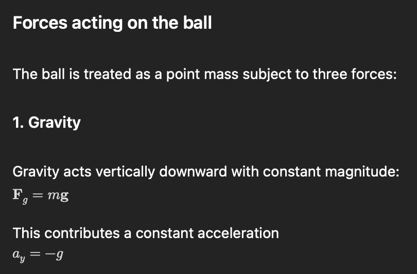
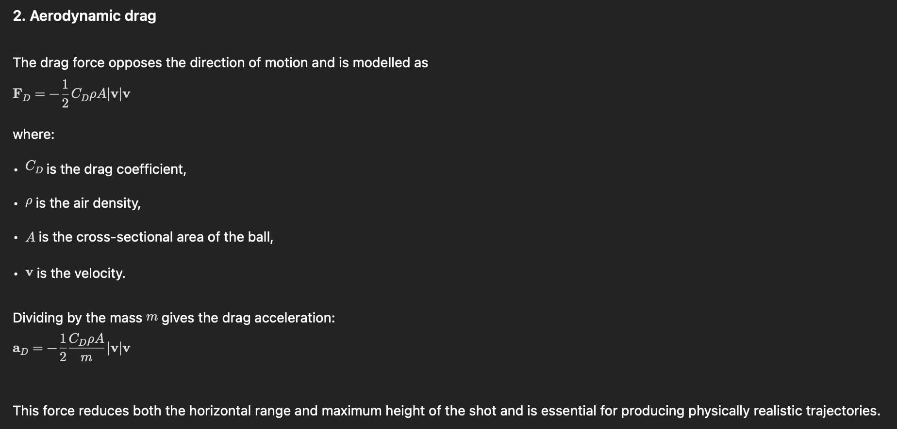
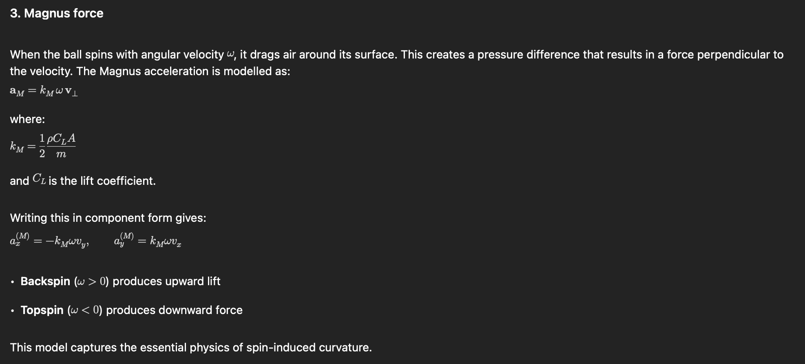
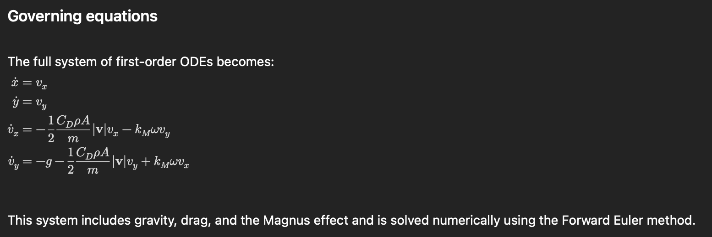
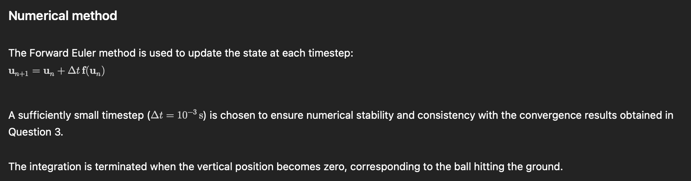
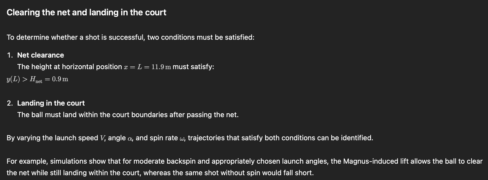

In reality, a tennis ball does not simply experience gravity and air resistance. When the ball is spinning, it interacts with the surrounding air in a way that produces an additional force known as the Magnus force. This force acts perpendicular to the direction of motion and is responsible for phenomena such as topspin shots dipping sharply and backspin shots “floating”.

In this question, the numerical model developed in previous sections is extended to include the Magnus effect, allowing us to investigate how spin influences whether a tennis shot clears the net and lands in the court.

Effect of spin on the trajectory

Numerical simulations show that including the Magnus effect significantly alters the trajectory:
	•	Backspin increases lift, allowing the ball to travel higher and further.
	•	Topspin causes the ball to dip more sharply, reducing range but allowing aggressive shots that still land in the court.
	•	Compared to drag-only motion, the Magnus force introduces curvature that cannot be replicated by gravity or drag alone.

This behaviour is physically realistic and consistent with observed tennis shots.

Beyond the first bounce (discussion)

After the first impact with the ground, the ball will bounce and continue moving. Modelling this requires:
	•	A coefficient of restitution to reduce the vertical velocity
	•	Consideration of energy loss during impact

While not implemented in detail here, the numerical framework can be extended to simulate post-bounce trajectories and investigate whether a shot can bounce twice within the court.

In this question, the projectile model has been extended to include the Magnus effect, allowing the influence of spin on a tennis ball trajectory to be studied. The inclusion of the Magnus force introduces physically realistic curvature, enabling shots that clear the net and land in the court under conditions where drag-only motion would fail. This demonstrates both the flexibility of the numerical model and the significant role of spin in real tennis shots.
